{}
# Enchanted Website
{}Project: Enchanted April Responsive Website{}
{}Role: Concept, Research, Design{}
{}Timeline: May-June 2021{}
{}

{}
{}
## Project Vision
Book sales soared during the Covid-19 pandemic as people sought escape into books. Fiction books were particularly popular. This website is for a new bookstore called Enchanted April. The bookstore is looking to streamline it's checkout process to make finding and purchasing a book as easy as possible. The website also contains a personal library to help customers keep track of their books and make sure they are aware when new books in their favourite series come out.
{}

{}
## Goals
1. Allow users to easily find the book they are looking for
1. Ensure checkout process is smooth
1. Create an element that will help this shop stand out
1. Create a responsive design
{}
{}

{}
## Getting Started
In this project, I took a goal-oriented design approach. This was very effective because it allowed me to focus on the aspects of the design I was optimizing. I conducted a literature review, a competitive audit, and user interviews. I then created user personas based on this information to help me keep the user front and center in the design process.

I kept the following considerations in mind as I moved throughout the research, ideation, and design phases of this project.

* Business Goals: What the business needs to succeed in the market.
* Users: Who is our audience? ( personas, etc.)
* User Goals: What goals will the users want to accomplish when using the website?
* Potential Features: How might we provide an innovative service to meet our users needs?
{}

{}
## Market Analysis
I looked at several other bookshop websites to get an idea of what was being offered by other stores. I paid special attention to the checkout process as this can be a pain point for some users. I evaluated several features that potential users and identified spaces where Enchanted April might be able to excel.
Competitors provide books ranging from the popular to the indy. One store has a subscription book club where they send you a surprise recommendation book every month. Others offer 48hr ordering on any book you are looking for, next day shipping, and extras such as t-shirts, mugs, or chocolate. Quality ranges from new to used, and prices are fairly stable across all platforms. The smaller bookshops all market themselves as independent bookstores with knowledgeable and passionate staff. However, they could do more to highlight suggested reads from the staff members. Furthermore, none of the sites helped users keep track of what books they already own. Through this process I identified this substantial gap that could be filled through my website design.

{}

{.p-img-fluid}
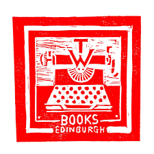
{.p-img-fluid}

{.p-img-fluid}

{.p-img-fluid}
{}
{}

{}
## Personas
{}
* Name: Betty
* Age: 33
* Occupation: FDA Scientist

Betty is a scientist for the FDA. She works long hours and is planning a wedding. She enjoys escaping into a good book, but wishes it was easier to find good books and check out quickly.
She is often frustrated when she buys duplicate books and wishes websites would tell you if you have already purchased a book.
{}

{}
* Name: Paul
* Age: 63
* Occupation: Retired

Paul is a retired factory manager for Ford. He likes to read to fill the time and socializes through his weekly book club.
He is frustrated with online book shopping because the buttons are not clear on all the sites. Furthermore, he likes talking to staff to get suggestions on what to read next, and he can’t do that online.
{}
{}

{}
## Information Architecture
I wanted users to be able to quickly and easily find the information they were looking for so I planned six distinct sections of the website.

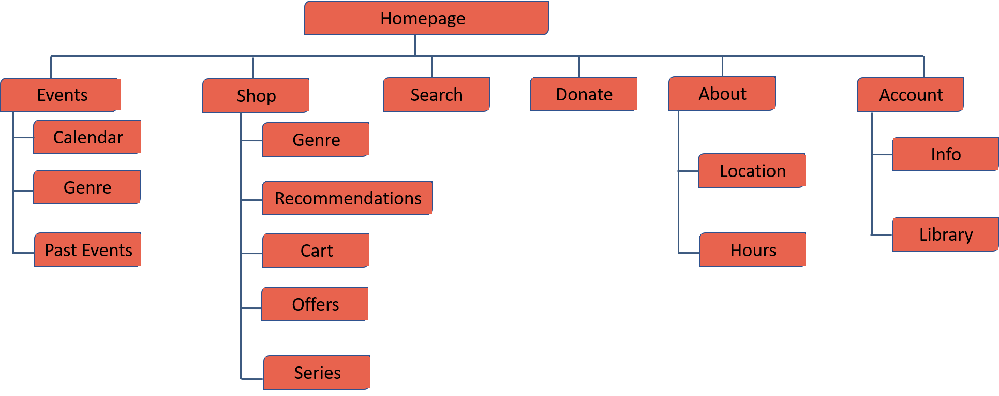
{.p-img-fluid}
{}

{}
## P & P Wireframes
I wanted to create a mobile-first design, so I started by creating pen and paper wireframes for the mobile version of the website. I also created one desktop screen to get an idea of how I wanted the website to respond to different screen sizes.

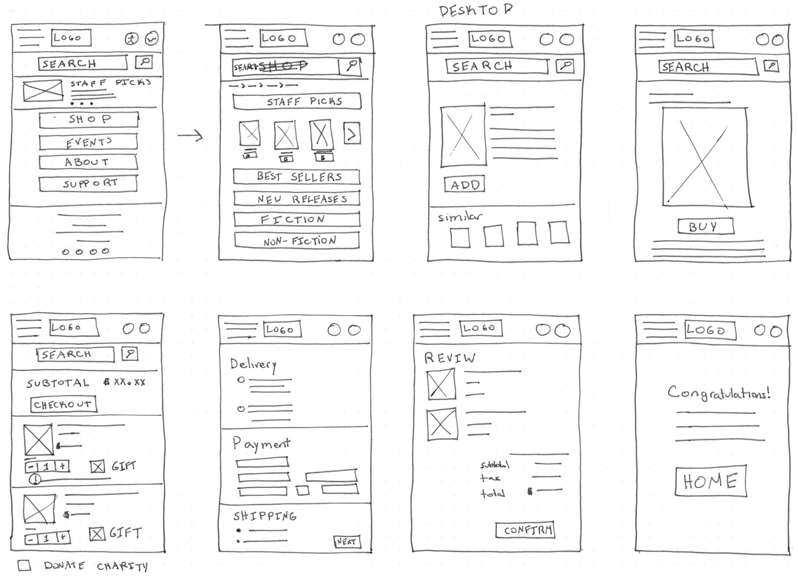
{.p-img-fluid}
{}

{}
## Wireframes
As I was primarily interested in designing the user journey for finding and purchasing a book, those are the sections I wireframed. I created digital wireframes based on my paper wireframes and continued to review what was necessary, unnecessary, and what needed improvement. I spent a lot of time on this step to make sure that the underlying process was as clear as possible before moving on to visuals.

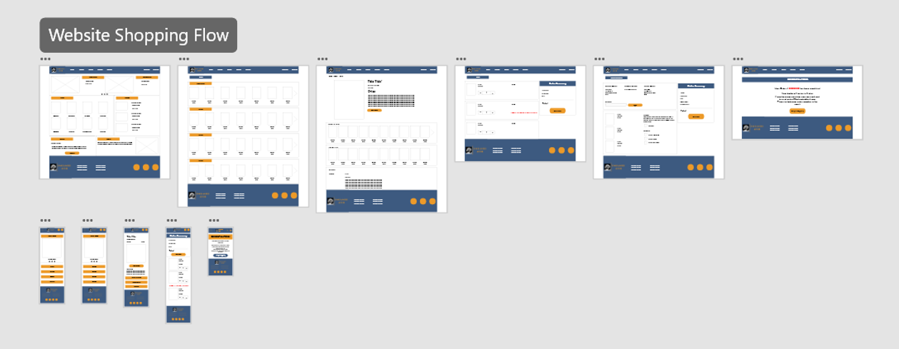
{.p-img-fluid}
{}

{}
## Prototype
I created a High Fidelity Prototype of my design to help users fully immerse themselves in the experience and explain the value to stakeholders. You can explore the full user flow with [AdobeXD](https://xd.adobe.com/view/fc2ffe01-29d2-4867-98ec-20e2eae85f65-a97c/?fullscreen).

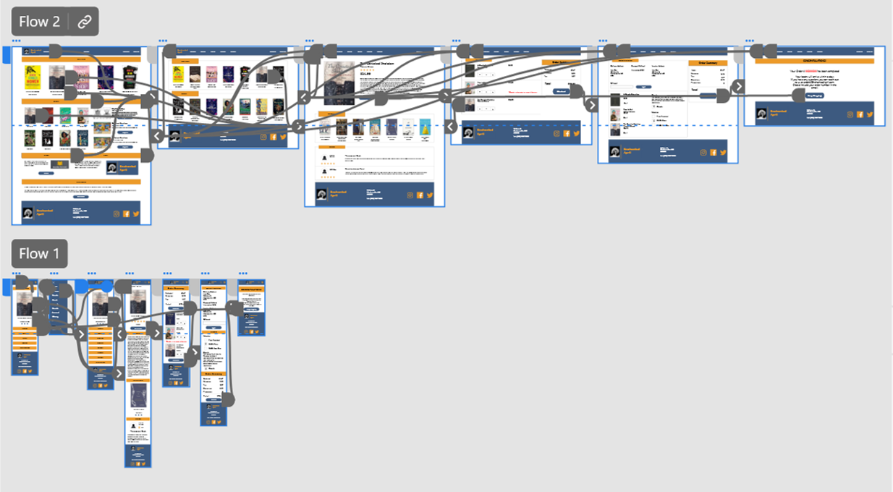
{.p-img-fluid}
{}

{}
## Goal 1
Allow users to easily find the book they are looking for
{.lead}

I wanted the user to have multiple different ways of finding the book they were looking for. Users can use the search function if they are looking for a specific book, browse books by genre, check out recent best sellers, or look at staff recommended books.

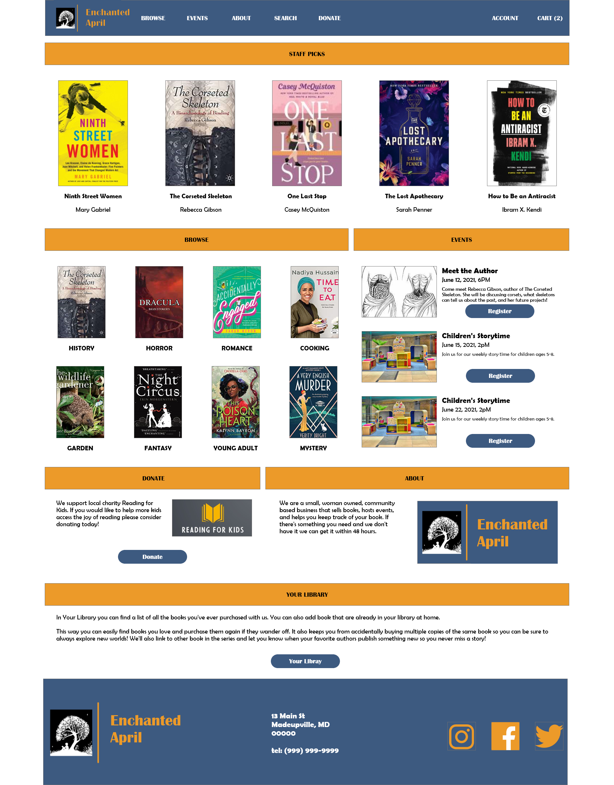
{.p-img-fluid}
{}

{}
## Goal 2
Ensure checkout process is smooth
{.lead}

I really wanted this website to be quick and easy to use. I tried to include the necessary information without giving the users too many screens to click through so they could complete their order quickly.

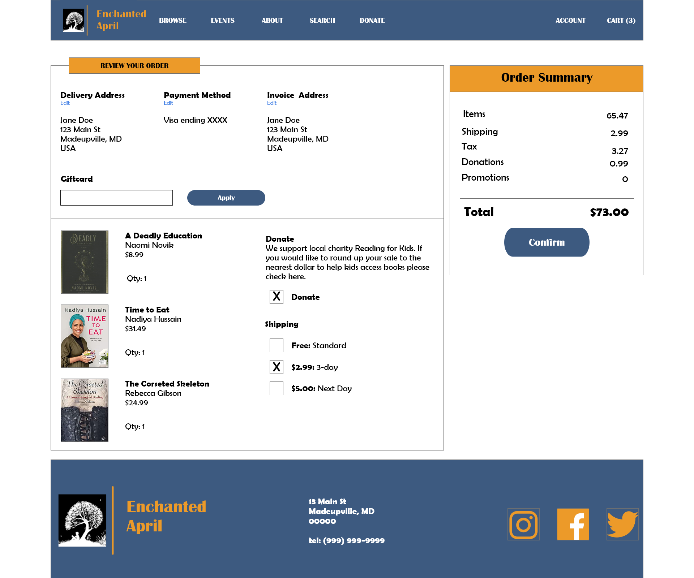
{.p-img-fluid}
{}

{}
## Goal 3
Create an element that will help this shop stand out
{.lead}

Based on my user research, I discovered many users would like a way to keep track of what books they already own to ensure they are not buying unnecessary duplicates. As a result, I decided to add a "My Library" feature. This feature will alert you on the cart page that you already have this book in your library. "My library" will contain a list of all books purchased through this site, and also allow users to add books purchased elsewhere. This will further benefit the user and business because alerts can be customized to inform users when new books in their favourite series or by their favourite authors have come out.

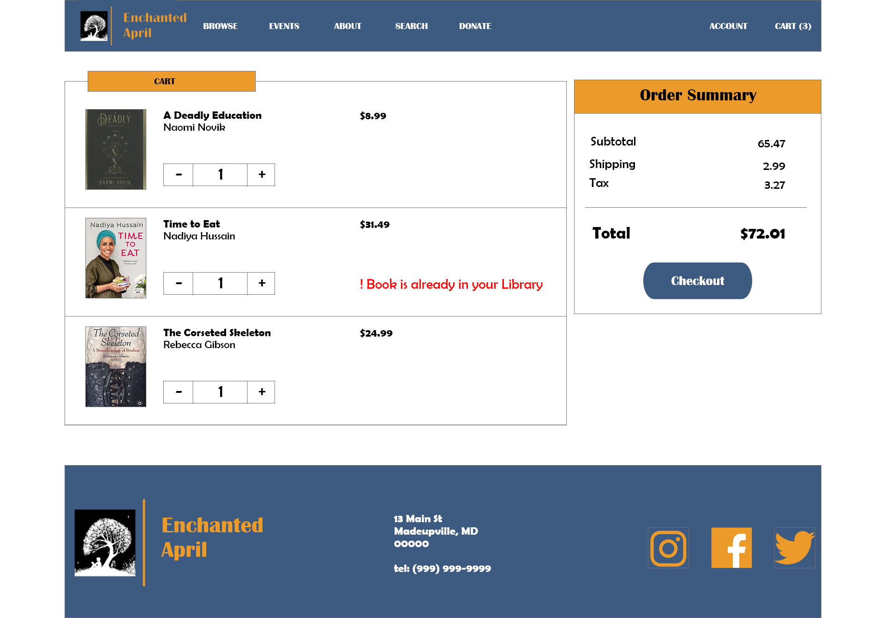
{.p-img-fluid}
{}

{}
## Goal 4
Create a responsive design
{.lead}

I wanted this app to be convenient to use regardless of where the user is and what device they are one. Therefore, it was vital to create a good user flow on multiple screen sizes. I started out by thinking about what I wanted my smaller screens to look like. I then used those elements and rearranged them to create the larger screens.

{}
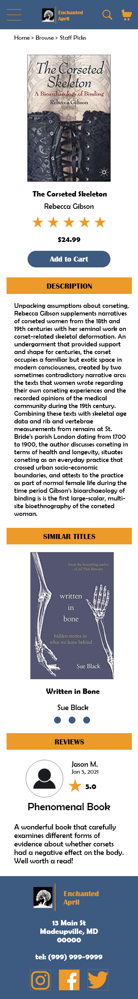
{.p-img-fluid}
{}
{}
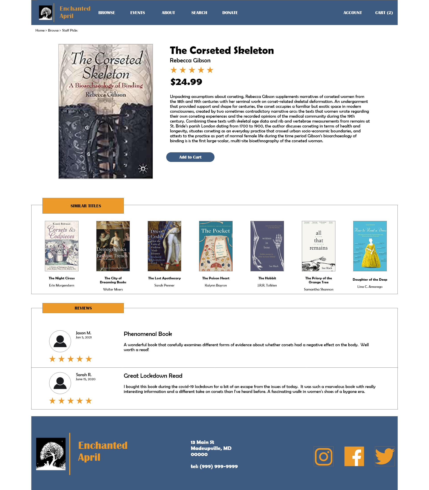
{.p-img-fluid}
{}
{}

{}
## Style Guide
I wanted to keep my design focused on the product so I chose a clean, minimalist look with minimal colors. I opted to use four colors: yellow, blue, and black and white for high contrast accessible colors. For the fonts I used Britannic and Berlin Sans as both these fonts have a vintage feel to them and the store name was inspired by a book published in 1922. I stayed away from more traditional Art Deco fonts as many of them are not accessible.

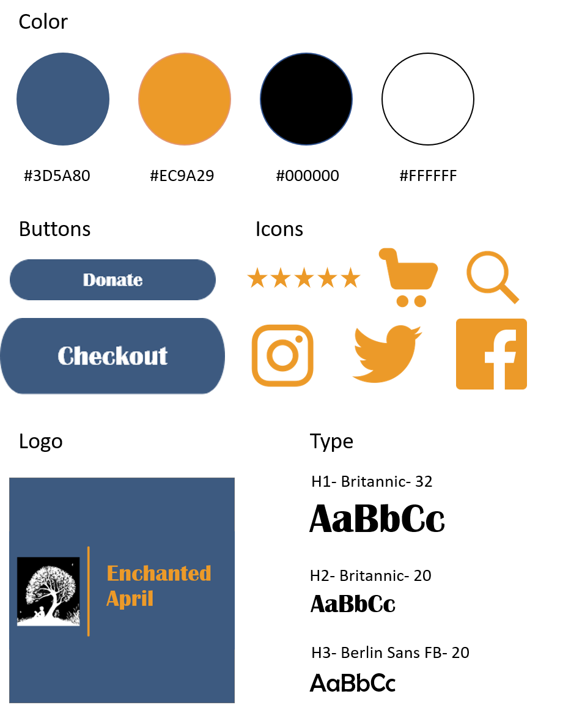
{.p-img-fluid}
{}

{}
## Takeaways
As someone who loves reading I found working on this project very rewarding. I got to experiment with Adobe XD design features, and refine my process for creating clear, accessible, and easy-to-use designs. I also got to incorporate my passion for public good through the donate option, and solved a problem I myself sometimes have- buying multiple copies of the same book!
{}
