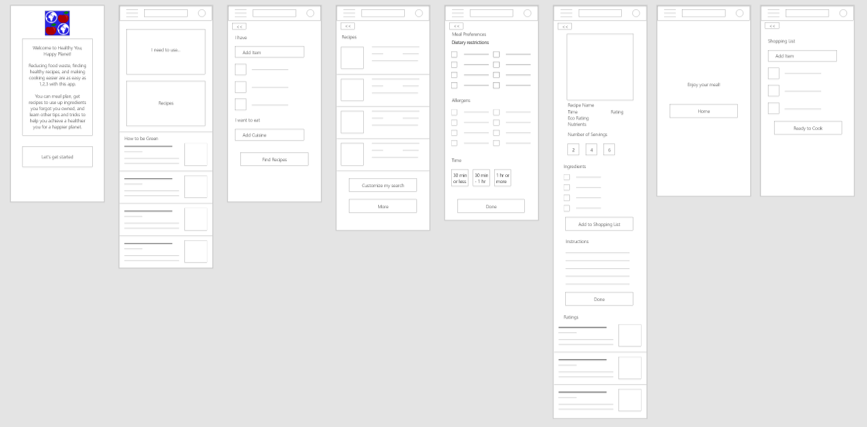
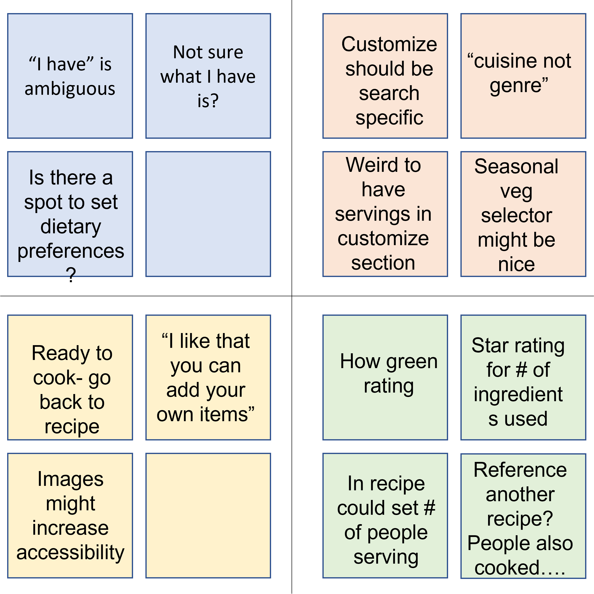
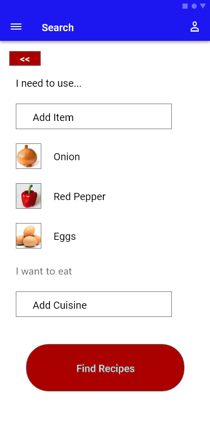
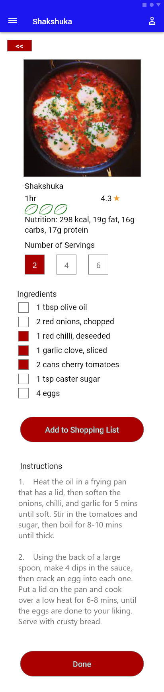
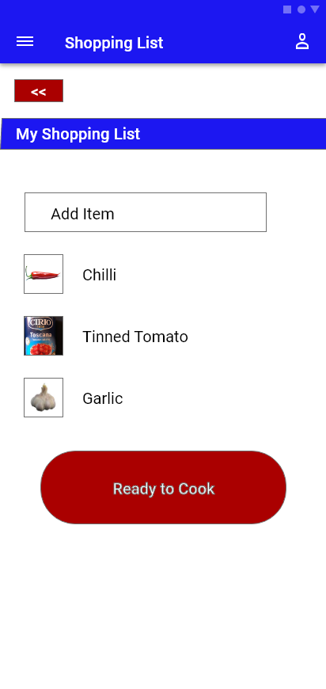
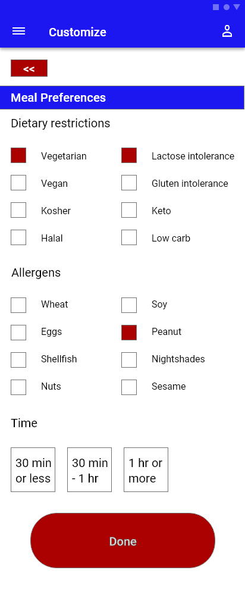
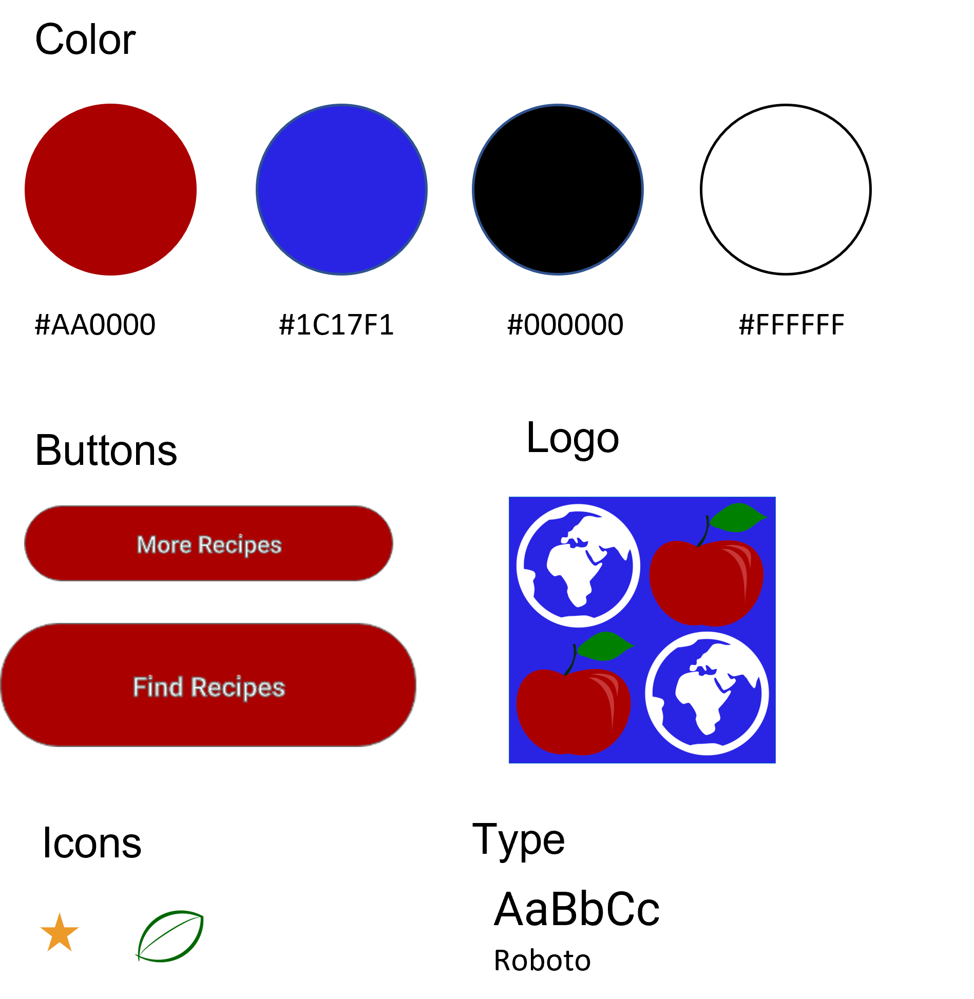

{}
# Food Waste App
{}Project: Healthy You, Happy Planet{}
{}App	Role: Concept, Research, Design	{}
{}Timeline: June -July 2021{}
{}

{}
{}
## Project Vision
The planet is warming and there is an obesity epidemic. This platform will address both these issues through helping people find and cook easy, healthy recipes using the ingredients they already have on hand to help reduce food waste.
{}

{}
## Goals
1. Allow users to search for recipes based on ingredients
1. Integrate with a shopping list function so users know what they need to buy
1. Allow users to set dietary preferences and allergies in their profile

{}
{}

{}
{}
## Getting Started
To start off I asked myself some basic questions.  Who is our primary user? What kind of goals do they have? Why would someone want to use this application? Qualitative research methods are the most useful for answering these types of questions. Therefore, I conducted remote and in-person user interviews to get feedback from my prospective users on these topics.
{}

{}

{.p-img-fluid}

{}
{}

{}
## User Interviews 		
I interviewed four different potential users and talked to them about what they would find useful in an app to reduce food waste and find healthy recipes.  All four research participants said they wanted to be able to search for recipes based on what food they had available that was going off. Creating this function became my primary goal. 

Users wanted to use this app for 3 main reasons: to reduce food waste, to save money, and to find healthy recipes.  As not all users were heavily motivated by concern for the climate, I decided not to push the environmental aspect of the app.  Users were also concerned with being able to exclude recipes that contained allergens or food they dislike from the recipes to make sure they can find what they are looking for. One user also suggested that there should be an option to rank recipes based on the number of ingredients used which would be an excellent feature to add in a future iteration.

{}

{}
## Personas
{}
* Name: Natasha
* Age: 38
* Occupation: Programmer

Natasha has been a software programmer since she graduated and has a demanding job. She worries about the world she is leaving for her daughter to live in and wants to reduce her carbon footprint, starting with reducing food waste. She also wants to make sure the meals she is making are healthy and don’t rely on processed foods.
{}

{}
* Name: Alistair
* Age: 20
* Occupation: Student

Alastair is from the Orkney Islands and is studying in Glasgow. He’s gained the freshman 15 because he loves a chippy and a beer but would like to lose some weight.  He’s on a tight student budget so he needs cheap and healthy meals to make for himself. He wants to maximize his budget and help the planet by reducing food waste.
{}

{}
* Name: Patrick
* Age: 43
* Occupation: Plumber

Patrick is a plumber from York. He loves his job but sometimes eats at odd hours because he’s at work or on call. He likes having things he can grab and eat quickly, but dislikes eating the same leftovers multiple days a week. He’s recently started working out and backpacking. He needs to make sure he’s getting the right nutrients to build muscle.
{}
{}

{}
## Wireframes
The purpose of this wireframe is to walk the user through the main user journey to find a recipe to use up ingredients. I created a home page, a page to input your ingredients, a page to set your preferences, a results page, a recipe page, a shopping list page, and a user journey complete page. I then created digital wireframes and linked them to create a prototype based on my paper wireframes. 

{.p-img-fluid}
{}

{}
## User Testing
After creating my low fidelity prototype I conducted a remote moderated usability study with four participants. My goal for this usability study was to determine whether the app is clear to navigate and functions as users expect. All four of my participants were interested in eating healthy. The study included 2 males and 2 females between the ages of 30 and 70. One participant is dyslexic. 1 participant is not fussed about the environment. 1 participant is a body builder.  

Following the usability study I created an affinity diagram that grouped user feedback into four separate categories.  I used this data to create insights and iterate on my wireframes so the final product will meet more user needs.

{.p-img-fluid}
{}

{}
## Prototype
I created a High Fidelity Prototype of my design, incorporating the feedback from the usability study, to help users fully immerse themselves in the experience and showcase the value to stakeholders. You can explore the full user flow with [AdobeXD](https://xd.adobe.com/view/2fba2be4-9b38-4bf8-a339-47d78c326c15-7ae9/).

{.p-img-fluid}
{}

{}
{}
## Goal 1
Allow users to search for recipes based on ingredients
{.lead}

I wanted the user to be able to search for a recipe based on the ingredients they have in their cupboards. Therefore I decided to create a search function that sorts recipes both by ingredients and types of cuisine.
{}

{}

{.p-img-fluid}
{}
{}

{}
## Goal 2
Integrate with a shopping list function so users know what they need to buy
{.lead}

I really wanted this app to be a one-stop-shop for people to do meal planning, creating shopping lists, and find information about living healthier and more environmentally friendly lives. As a result, I integrated the shopping list function into the recipe page to make it easy for users to add items they need to make a recipe without having to fuss going back and forth between screens trying to remember different ingredients. I also included space for resources on living healthier and more environmentally friendly lives on the homepage.

{}

{.p-img-fluid}
{}
{}

{.p-img-fluid}
{}
{}

{}
{}

{.p-img-fluid}
{}

{}
## Goal 3
Allow users to set dietary preferences and allergies in their profile
{.lead}

As we’re all becoming more aware, there are a variety of food restrictions including allergies, religious restrictions, and preferences that individuals ascribe to.  In order to accommodate these dietary restrictions I decided to add a customization section that allows users to input their preferences for food, as well as the length of time they want to spend cooking.  This customization field can be accessed either through the profile tab to create permanent settings, or thought the search function in case a cook needs to adjust their normal meals for someone with an allergy or dietary restriction.
{}

{}

{}
## Style Guide
I wanted to have my design aesthetic reflect the purpose of the app.  I took inspiration for the logo from the old phrase “an apple a day keeps the doctor away” and included an image of the world as the app also aims to combat climate change. I settled on blue and red as my primary colors to reflect the apple I used in the logo, and the oceans of our planet. I also utilized white a black for high contrast, easy to read text. For the font I used Roboto as it is a modern, clean, minimalist font which pairs well with the design aesthetic I am aiming for.

{.p-img-fluid}
{}

{}
## Takeaways
As a passionate proponent of more accessible and engaI enjoyed the opportunity to work on a project for social good.  This project also allowed me to dovetail my volunteer work on carbon emission reduction with my passion for design . I got to experiment with Adobe XD design features, and refine my process for creating clear, accessible, and easy-to-use designs. 
{}
