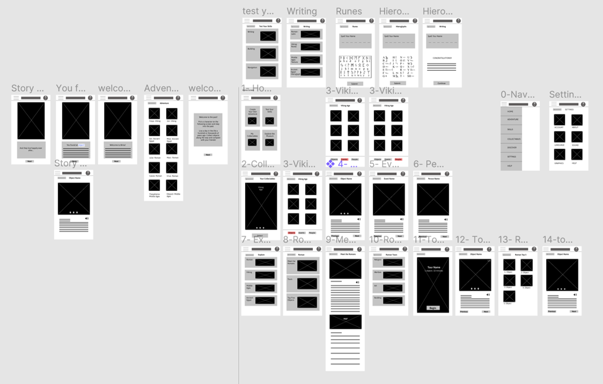

{}
# Museum App
{}Project: Museum Engagement{}
{}App	Role: Concept, Research, Design	{}
{}Timeline: April -May 2021{}
{}

{}
{}
## Project Vision
Covid-19 has kept museums closed, depriving students of field trips to learn about other cultures and history. This app seeks to create a curated museum experience to help students remotely engage with museum objects and give them the opportunity to explore topics that interest them further without leaving their home.
{}

{}
## Goals
1. Present information in an engaging format
1. Emphasize accessibility
1. Provide multiple avenues for exploration
1. Ensure app is trustworthy
{}
{}

{}
## Getting Started
{}
To start I asked myself some questions. What makes history engaging? How do I ensure the information is considered trustworthy? And what would be useful to the user?

After interviewing the users I discovered that they really liked the gamification aspect of the app and felt it created a more engaging experience. They also found that they could trust the source, assuming it is a respected museum and their logo is attached to the app. Finally, although individuals liked the app, there were some concerns about simplifying the navigation.
{}

{}

   

      <button type="button" data-bs-target="#gettingStartedCarouselIndicators" data-bs-slide-to="0" class="active" aria-current="true" aria-label="Slide 1"></button>
      <button type="button" data-bs-target="#gettingStartedCarouselIndicators" data-bs-slide-to="1" aria-label="Slide 2"></button>
      <button type="button" data-bs-target="#gettingStartedCarouselIndicators" data-bs-slide-to="2" aria-label="Slide 3"></button>
      <button type="button" data-bs-target="#gettingStartedCarouselIndicators" data-bs-slide-to="3" aria-label="Slide 4"></button>
   

   

      

         
   

      

         
   

      

         
   

      

         
   

   

   <button class="carousel-control-prev" type="button" data-bs-target="#gettingStartedCarouselIndicators" data-bs-slide="prev">
      
      Previous
   </button>
   <button class="carousel-control-next" type="button" data-bs-target="#gettingStartedCarouselIndicators" data-bs-slide="next">
      
      Next
   </button>

{}
{}

{}
## Market Analysis 		
I looked at several other museum apps and websites to get an idea of what was being offered by other museums. I was particularly interested in seeing how they were adapting to covid.. The draw for many museum apps is the unique collections held at that museum, so comparison between apps is indirect as the objects on offer vary from museum to museum
I noted that other museums have produced both online collections that can be accessed via the web, as well as mobile phone apps. The quality varies across sectors depending on the purpose of the app or collections database.The objects are just that, objects that are often removed from further context which would create a richer experience for the user. There is an opportunity then to create that more engaging, richer user experience through this app.

{}

{.p-img-fluid}

{.p-img-fluid}

{.p-img-fluid}
{}
{}

{}
## Personas

{.p-img-fluid}

{.p-img-fluid}
{}

{}
## Information Architecture
As the point of this app is to encourage exploration of historical periods and sites, I wanted the information architecture to be clearly thought out. I anticipated that the IA could get messy if it was not well planned so I created 5 distinct sections of the app and kept information contained within their categories.

{.p-img-fluid}
{}

{}
## Wireframes
After completing some pen and paper wireframes I thought about what was necessary at this step and conducted user research. I received some really excellent feedback on what aspects of the design were clear and which aspects needed to be iterated upon to improve functionality. I included these suggestions in my design and created improved digital wireframes.

{.p-img-fluid}
{}

{}
## Prototype
I created a High Fidelity Prototype of my design to help users fully immerse themselves in the experience and explain the value to stakeholders. You can explore this app on [Figma](https://www.figma.com/file/ULOAxXWbSkCvsoO1zT1bhT/Museum-App-Wireframe?node-id=79%3A2).

{.p-img-fluid}
{}

{}
## Goal 1
Present information in an engaging format
{.lead}

_"What a great way to make learning fun."_ (User 5)

_"It reminds me of those old choose your own adventure books. I loved those as a kid"_ (User 4)

Most users thought the interactive elements were the most engaging. They appreciated the context and story surrounding the objects which allowed them to immerse themselves more fully in the historical period. Future iterations of the app may take advantage of this engagement by creating more stories and games to test the user's skills.

{.p-img-fluid}
{}

{}
## Goal 2
Emphasize Accessibility
{.lead}

I really wanted this app to be accessible to people of different abilities and learners at different stages in their education. As a result I made sure there were images associated with most of the text to help tell the story. For users who want to access the material in a different way, I ensured that the objects and tours all had optional audio. I also added the option to change the language of the app for foreign language speakers. The language I used for the copy is also age appropriate for younger visitors, or visitors for whom English is not their first language.

{.p-img-fluid}
{}

{}
## Goal 3
Provide multiple avenues for exploration
{.lead}

{}
In order to promote exploration I created four different ways of interacting with this app. Users can play through create-your-own-adventure stories based on the old books of a similar name. They can also play games to figure out if they have the skills to survive in the past, collect different objects that they can then compare with their friends, or access tours if they are on-site. By provided a variety of different entry points into learning I employed techniques used in Universal Design for Learning to promote engagement and inclusivity in learning design.
{}

{}

{.p-img-fluid}
{}
{}

{}
## Goal 4
Ensure app is trustworthy
{.lead}

{}

{.p-img-fluid}
{}

{}
With the prevalence of fake news and issues surrounding trustworthiness of information sources, I was particularly concerned with making sure the user would trust the information the app was providing. I was worried that the gamification of learning about the past might make the information seem less trustworthy. When I conducted my user research I asked participants about the perceived trustworthiness of the app. The majority of participants said if the app came from a reputed museum and that museum logo was featured prominently on all of the pages they would feel confident in the veracity of the information in the app. As a result, I featured the museum logo at the top of every page. I also included an about page in the settings where users can learn more about who is providing the information to increase transparency and trustworthiness.
{}
{}

{}
## Style Guide
I wanted to keep it simple, modern, and fun throughout so I opted for four colors: light mauve, teal, and black and white for high contrast accessible colors. The font is Asap. I purposefully chose not to make a name for this museum as user's indicated the source of the museum itself is important for trustworthiness and I want to make clear that this app is not, at present, associated with any particular museum. The colors and fonts would change to reflect the brand style of whatever institution chose to use it.

{.p-img-fluid}
{}

{}
## Takeaways
As a passionate proponent of more accessible and engaging cultural spaces, it was fun for me to think about how a museum might take the covid-19 pandemic and use the limitations caused by it to create more engaging digital spaces. I explored different design principles while creating this app and centered the users feedback in the iterations I made.
{}
