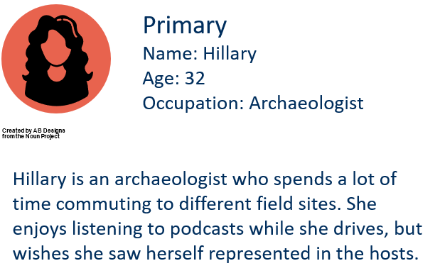
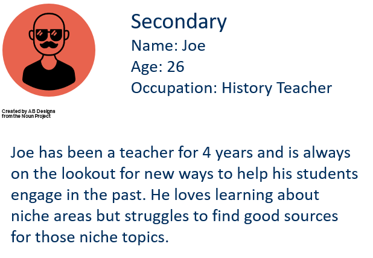
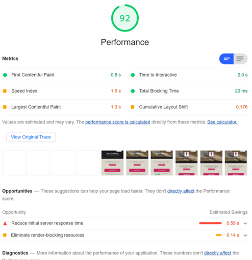
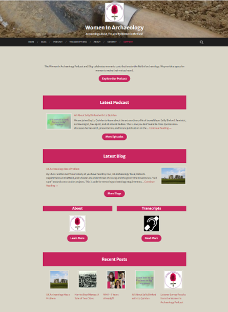
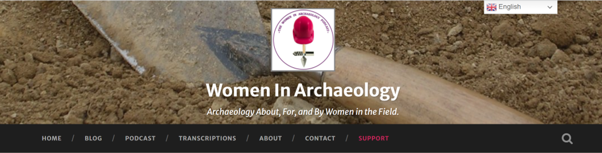
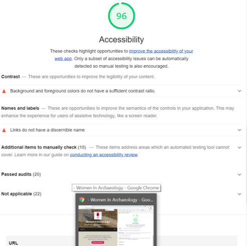
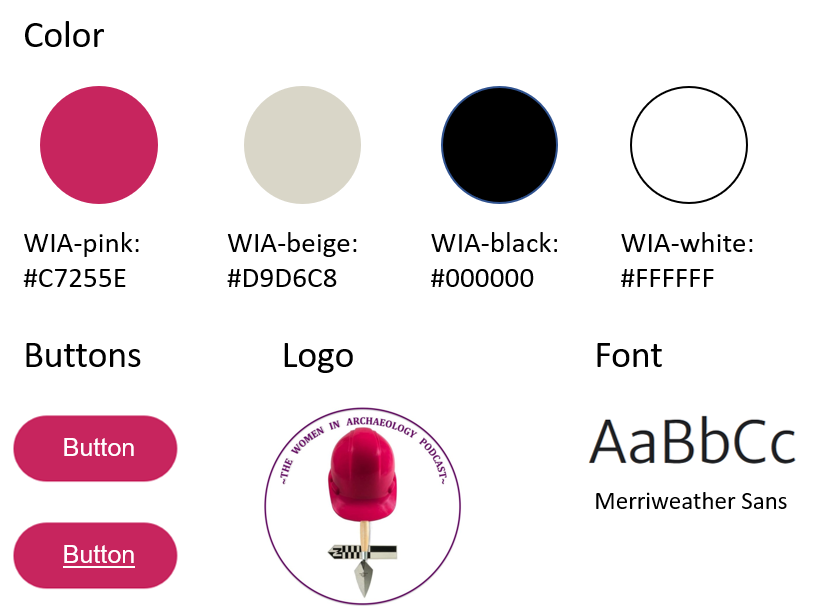


# Podcast Redesign
Project: WIA Update
Role: Concept, Research, Design
Timeline: March-May 2021




## Project Vision
The Women in Archaeology Podcast and Blog (WIA) celebrates women's contributions to the field of archaeology. It provides a space for women to make their voices heard. Founded in 2016, a rebrand was in order to bring the site up to date, improve performance, improve accessibility, and clean up and standardize the UX.



## Goals
1. Speed up the website load time
1. Streamline the homepage
1. Update header for easier navigation
1. Prioritize accessibility in design




## Getting Started
To start iterating on the previous design I asked myself some important questions. How could we make navigating the site clearer? Are we still providing content that aligns with our users needs? How large a redesign do we want this to be? After conducting an audience survey I discovered that much of the feedback fell into three categories: usability of the website, topics for discussion, and the importance of highlighting female voices in the field.


		
## Market Analysis 		
In order to ensure the Women in Archaeology Podcast and Blog (WIA) is still at the forefront of public outreach in archaeology I had to look at what other archaeology outreach platforms are doing. I evaluated several features that users value for ease of navigation and looked at which ones WIA could use to improve our own offerings.
I found that two archaeology outreach sites have outdated UI. Three of the five sites we looked at scored poorly on performance using Google's Lighthouse tool. Furthermore, only two alternative sites use categories to organize their content. This provides an opportunity to make the WIA site easier to navigate and locate content on than the other sites.

|                                | APN          | TrowelBlazers | The Dirt     | TrowelTales  | AnimalArchaeology |
|--------------------------------|--------------|---------------|--------------|--------------|-------------------|
| Blog                           |  |   |              |  |       |
| Podcast                        |  |               |  |  |                   |
| Search Feature                 |  |   |              |  |       |
| Categories                     |              |               |              |  |       |
| Modern UI                      |              |   |  |              |       |
| Regular Posting                |  |   |  |              |       |
| References                     |  |   |  |  |       |
| Performance _(via Lighthouse)_ | 27           | 94            | 41           | 82           | 67                |
{. class="table table-striped table-bordered table-hover tr-text-center tr-first-col"}



## Prioritization
Plotting the priority and effort of making the changes helped to decide which change to tackle first, and which changes could be addressed later on. Priority was assigned based on perceived added value and the number of users who mentioned the item as an impediment to use. The time available to tackle certain tasks factored into the effort score. Some items were originally categorized as low effort, but became high effort due to the limitations of the wordpress theme used for the site. A big draw for the site is that it prioritizes women's voices, which is rare in the field of archaeology. Therefore, we want to make it as easy as possible for users to discover the content they are looking for in the format they prefer.

{.p-img-fluid}



## Personas

{.p-img-fluid}

{.p-img-fluid}



## Goal 1
Speed up the website load time
{.lead}

{.p-img-fluid}

By updating the homepage I drastically improved the performance of the website.  I utilized Lighthouse in Chrome DevTools to identify areas for improvement. I also removed unused widgets, optimized image sizes, and reevaluated some of the plugins on the site to ensure these gains were seen site wide. 



## Goal 2
Streamline the homepage
{.lead}

{.p-img-fluid}

In order to improve navigation of the site I created a new homepage that highlights the main areas of the site. I also ensured that the above-the-fold content included a description of what the site is about. I utilized the same pink as is used in our logo for all the headings to ensure brand consistency and clearly delineate the different sections of the page.



## Goal 3
Update the header for easier navigation
{.lead}

{.p-img-fluid}

The previous header took up most of the above-the-fold space on the page. Furthermore, the text to background contrast was not very accessible and the navigation bar broke into two lines on some devices. In order to address this I reduced the margin and padding size around the elements contained in the header. I also updated the header template for the theme to change the font color, an option that was not possible without changing the code. I then shortened the navigation titles for clarity and created a call to action to communicate to the user that we would like their support.



## Goal 4
Prioritize accessibility in the design
{.lead}

{.p-img-fluid}

While redesigning the homepage I focused on ensuring our content was as accessible as possible. I ensured that all images have alt text, a practice we already employed, used color contrast checking services to ensure our text was easily readable, and improved the header to improve accessibility as previously described. I utilized Lighthouse in Chrome DevTools to identify other areas of improvement throughout the site as well. We are also continuing to improve our accessibility by creating transcripts for our episodes.



## Style Guide
I wanted to keep it simple and consistent throughout so we stuck with four colors: the pink from our logo, a beige that reflects the dirt we often dig in, and black and white for high contrast accessible colors. The font is Merriweather Sans and the heading styles are set by the theme.

{.p-img-fluid}



## Takeaways
As one of the original hosts for this podcast, updating the website to better reflect our brand and increase usability was really rewarding. I got to learn some more coding, learn about our users needs, and then implement solutions to ensure we meet those needs. There are still design elements to improve upon and I look forward to incorporating those changes in future iterations of the site.

